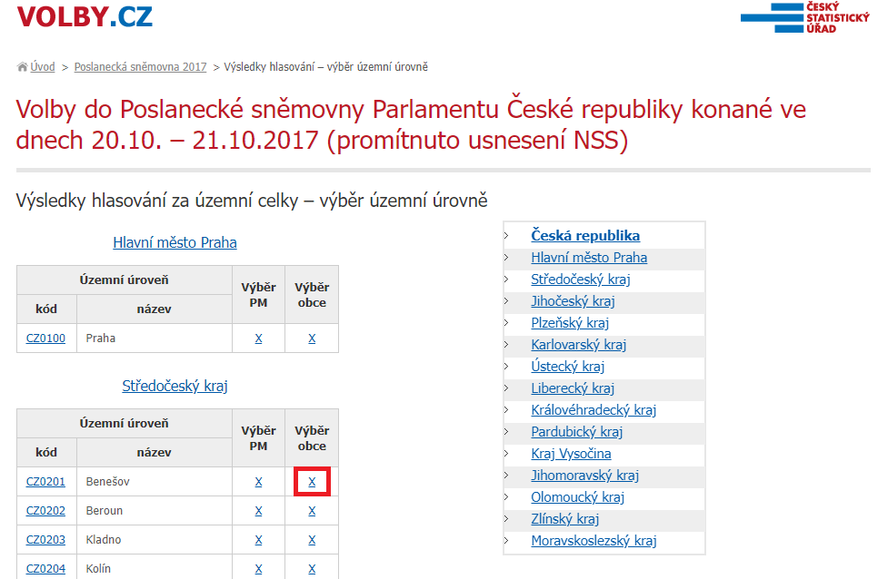

# Elections scraper
Skript Elections scraper shromažďuje výsledky voleb z roku 2017, který vytáhne data přímo z [webu][1]. Lze vybrat jakýkoli územní celek (okres) z vybraného odkazu, např. X (Výběr obce) [Benešov][2], se "vyscrapují" výsledky hlasování pro všechny obce.



## Ukázka projektu

Výsledky hlasování pro okres Jindřichův Hradec:

1. argument (odkaz): ```https://volby.cz/pls/ps2017nss/ps32?xjazyk=CZ&xkraj=3&xnumnuts=3103```

2. argument (název souboru CSV): ```vysledky_jindrichuv-hradec.csv```

## Před spuštěním
- instalace potřebných knihoven ze souboru requirements.txt.

```
pip3 install -r requirements.txt
```

## Spuštění programu

```
python main.py "https://volby.cz/pls/ps2017nss/ps32?xjazyk=CZ&xkraj=3&xnumnuts=3103" "vysledky_jindrichuv-hradec.csv"
```

## Průběh stahování:
```
Nechť scraping započne... 👾
🛸 Stahují se data... 🛸
Data se zapsala do souboru: 'vysledky_jindrichuv-hradec.csv'. 🚨
📯 Scraper se ukončuje. 📯
```

# Částečný výstup

```
Kód obce,Název obce,Voliči v seznamu,Vydané obálky,Platné hlasy,Občanská demokratická strana,Řád národa - Vlastenecká unie,CESTA ODPOVĚDNÉ SPOLEČNOSTI,Česká str.sociálně demokrat.,Radostné Česko,STAROSTOVÉ A NEZÁVISLÍ,Komunistická str.Čech a Moravy,Strana zelených,"ROZUMNÍ-stop migraci,diktát.EU",Strana svobodných občanů,Blok proti islam.-Obran.domova,Občanská demokratická aliance,Česká pirátská strana,Referendum o Evropské unii,TOP 09,ANO 2011,Dobrá volba 2016,SPR-Republ.str.Čsl. M.Sládka,Křesť.demokr.unie-Čs.str.lid.,Česká strana národně sociální,REALISTÉ,SPORTOVCI,Dělnic.str.sociální spravedl.,Svob.a př.dem.-T.Okamura (SPD),Strana Práv Občanů
562726,Báňovice,90,71,71,9,0,0,2,0,1,0,0,1,0,0,0,4,0,5,11,0,0,33,0,0,0,0,5,0
562548,Bednárec,87,47,47,8,0,0,8,0,3,0,1,0,0,0,0,9,0,0,14,0,0,3,0,0,0,1,0,0
```

[1]: https://volby.cz/pls/ps2017nss/ps3?xjazyk=CZ
[2]: https://volby.cz/pls/ps2017nss/ps32?xjazyk=CZ&xkraj=2&xnumnuts=2101